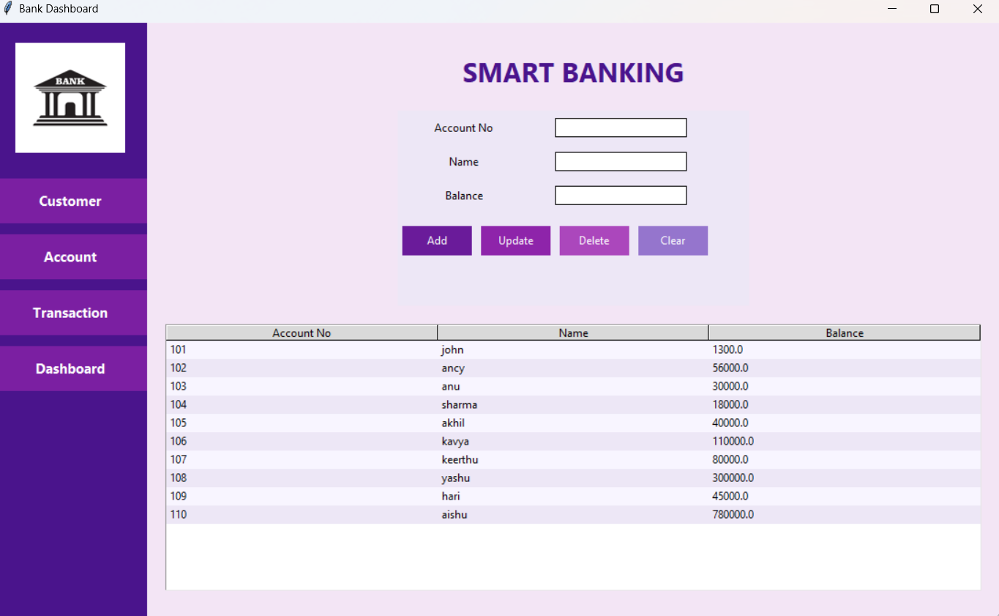
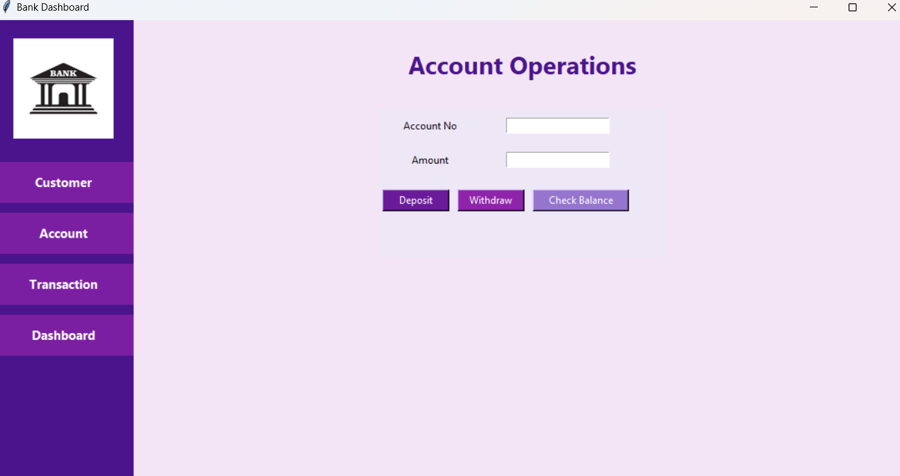
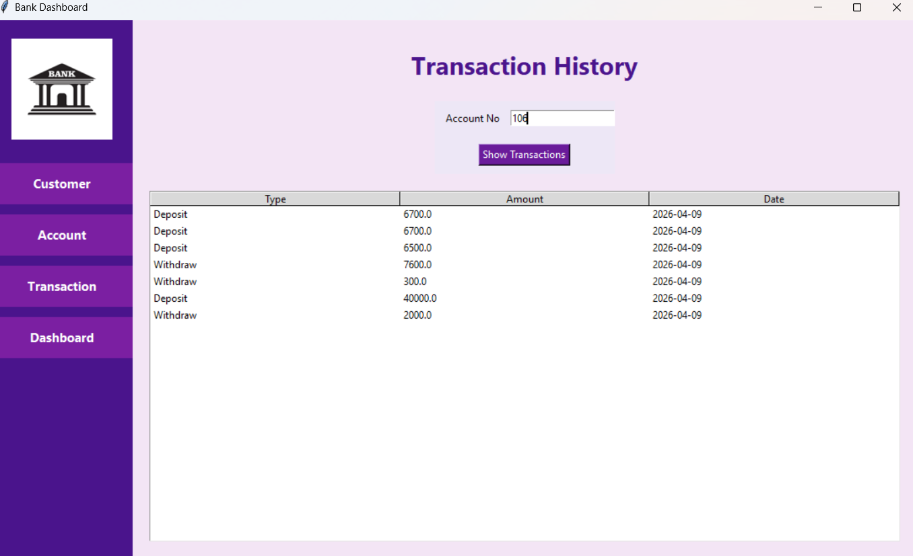
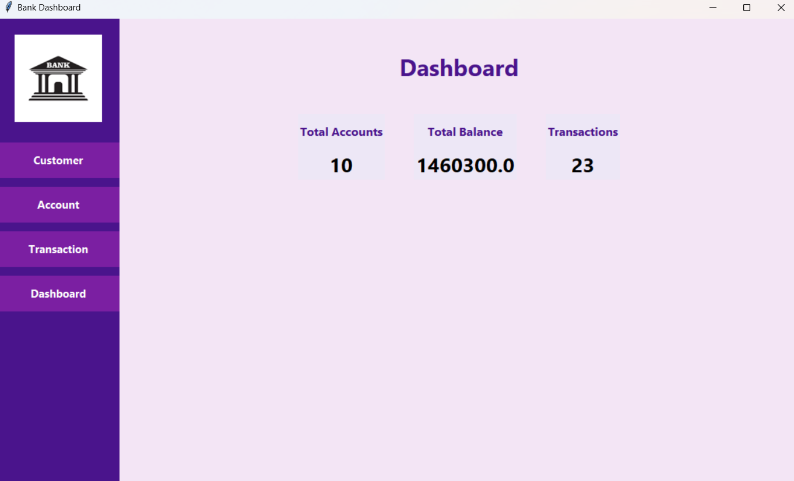

# 🏦 Smart Banking System

A GUI-based Banking Management System developed using Python, Tkinter, MySQL, and Pillow. This application provides essential banking operations such as account management, deposits, withdrawals, balance inquiries, and transaction tracking through an interactive dashboard.

---

## 🚀 Features

✅ Create New Accounts

✅ Update Existing Accounts

✅ Delete Accounts

✅ Deposit Money

✅ Withdraw Money

✅ Check Account Balance

✅ Transaction History Tracking

✅ Dashboard Analytics

✅ MySQL Database Integration

✅ User-Friendly Tkinter Interface

---

## 🛠️ Technologies Used

- Python
- Tkinter
- MySQL
- mysql-connector-python
- Pillow (PIL)

---

## 📂 Project Structure

```text
Smart-Banking-System/
│
├── main.py
├── requirements.txt
├── README.md
│
├── database/
│   └── bank_db.sql
│
└── screenshots/
    ├── customer.png
    ├── dashboard.png
    ├── account.png
    └── transaction.png
```

---

## ⚙️ Installation

1. Clone the repository

```bash
git clone https://github.com/akshayakn2006/Smart-Banking-System.git
```

2. Install required packages

```bash
pip install -r requirements.txt
```

3. Create the MySQL database using:

```sql
bank_db.sql
```

4. Update database credentials in `main.py`

5. Run the application

```bash
python main.py
```

---

## 📸 Screenshots

### Customer Management



### Account Operations



### Transaction History



### Dashboard



---

## 🎯 Learning Outcomes

This project demonstrates:

- GUI Development using Tkinter
- Database Connectivity using MySQL
- CRUD Operations
- Transaction Management
- Python Application Development
- Dashboard Design and Analytics

- ## Future Enhancements

- Money Transfer Between Accounts
- Account Search Functionality
- Export Transactions to CSV
- User Authentication
- Interest Calculation Module
- Dark Mode UI

---

## 👨‍💻 Author

**Akshay K N**

GitHub: https://github.com/akshayakn2006

---
